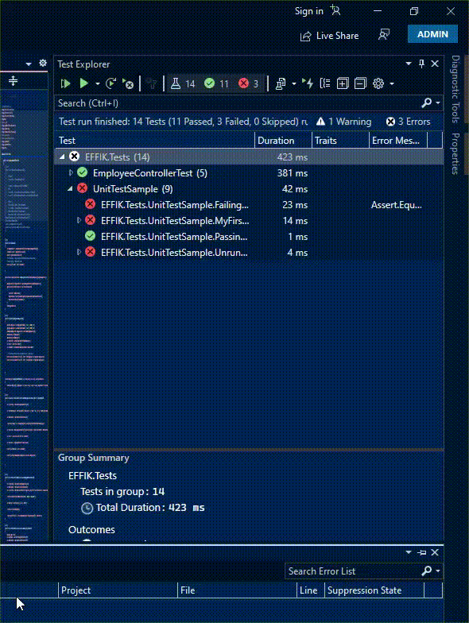

# TDD

This repository has been created for testing my skills on unit testing using XUnit and integration testing using Moq framework, basically applied Test Driven Developement on asp.net mvc 3/4 project controller assuming it has entity framework as an ORM with code first approach.

## You just need to rebuild/clean + build the project and open Test Explorer side menu from Test Menu in visual studio and run all test from that Test Explorer side menu or specific test as your wish. 

